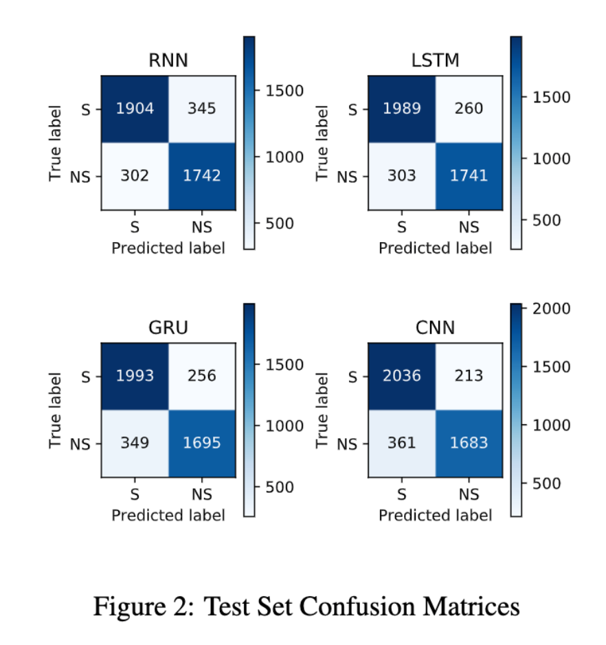

# Sarcasm detection

Comparing the performance of various model architectures on sarcasm detection in text. The dataset used is from Kaggle, consisting of news headlines from a legitimate news website (HuffPost) and a satirical news website (The Onion). The report further investigates the explanations for the respective models' predictions using LIME.

Work was done as part of UCL's Statistical NLP module, spring 2020.

